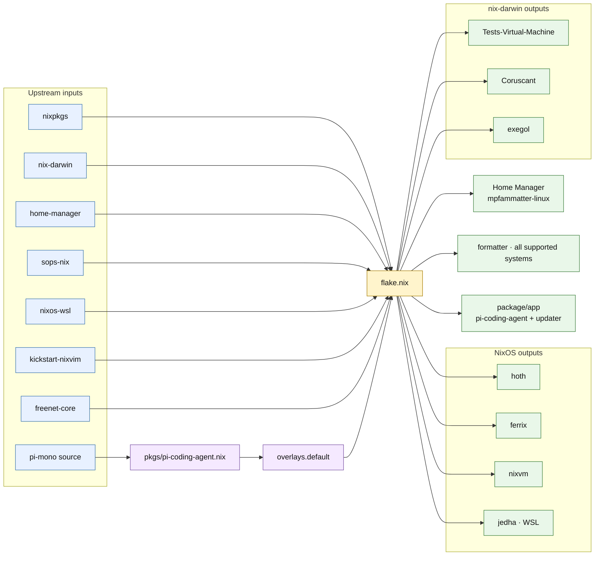
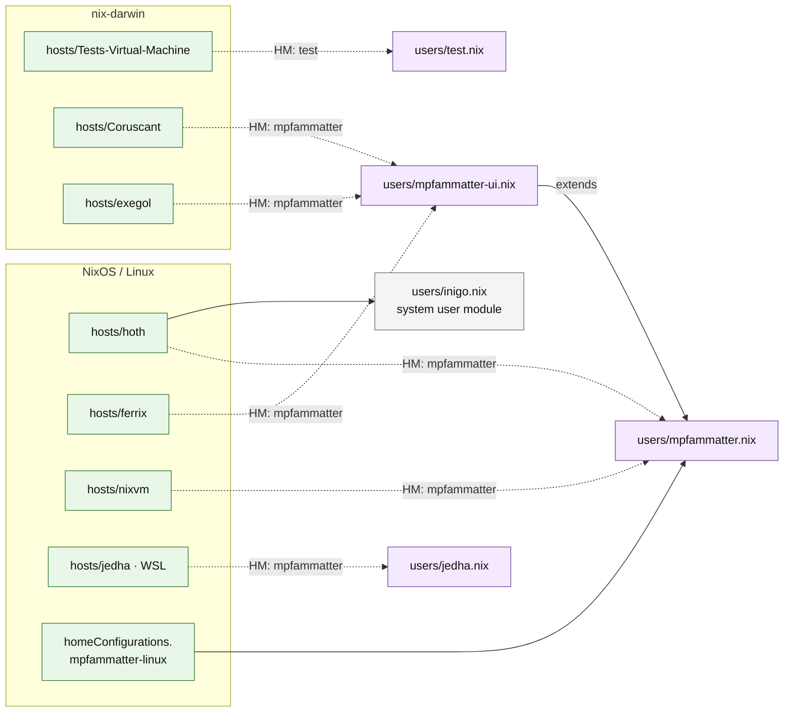
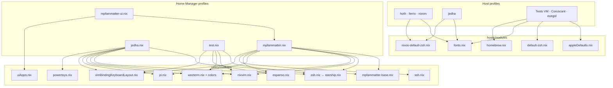
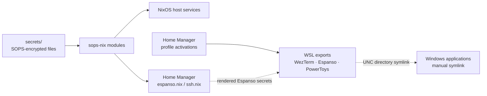

# Configuration wiring diagram

This repository has one entry point, `flake.nix`. It combines upstream flakes,
repo-local modules, and host/user profiles into NixOS, nix-darwin, and standalone
Home Manager outputs.

## Top-level wiring

The default overlay is injected into every package set constructed by
`flake.nix`. This is what makes `pkgs.pi-coding-agent` available to Home
Manager on every host. `pi-mono` supplies its source and version; the local
package expression supplies the reproducible Nix build and updater app.

## Host-to-user wiring

Solid arrows are direct host or profile imports. Dashed arrows show Home
Manager profiles attached by `flake.nix`.

| Flake output | System | Host module | Home Manager profile |
| --- | --- | --- | --- |
| `homeConfigurations.mpfammatter-linux` | x86_64 Linux | — | `users/mpfammatter.nix` |
| `nixosConfigurations.hoth` | x86_64 Linux | `hosts/hoth` | `users/mpfammatter.nix` |
| `nixosConfigurations.ferrix` | x86_64 Linux | `hosts/ferrix` | `users/mpfammatter-ui.nix` plus `rustdesk` |
| `nixosConfigurations.nixvm` | x86_64 Linux | `hosts/nixvm` | `users/mpfammatter.nix` |
| `nixosConfigurations.jedha` | x86_64 Linux / WSL | `hosts/jedha` | `users/jedha.nix` |
| `darwinConfigurations.Tests-Virtual-Machine` | Apple Silicon macOS | `hosts/Tests-Virtual-Machine` | `users/test.nix` |
| `darwinConfigurations.Coruscant` | Apple Silicon macOS | `hosts/Coruscant` | `users/mpfammatter-ui.nix` |
| `darwinConfigurations.exegol` | Apple Silicon macOS | `hosts/exegol` | `users/mpfammatter-ui.nix` |

## Shared-module wiring

Hardware configuration remains local to `hoth`, `ferrix`, and `nixvm`.
`ferrix` additionally imports `zulip.nix`; `hoth` imports the `inigo` system
user module; `jedha` imports the `nixos-wsl` module. All integrated Home
Manager profiles receive the relevant upstream shared modules from
`flake.nix`, including `kickstart-nixvim`; sops-enabled profiles also receive
the sops-nix Home Manager module.

## Secrets and generated/exported configuration

Encrypted files under `secrets/` are inputs only; decrypted values are
materialized by sops-nix at activation/runtime and must not be committed.
The Windows-facing exports are generated under `~/.local/share` by Home
Manager, then linked manually from Windows as documented in the main README.

## Apply paths

- NixOS host: `sudo nixos-rebuild switch --flake .#<host>`
- macOS host: `sudo darwin-rebuild switch --flake .#<host>`
- Standalone Linux profile: `home-manager switch --flake .#mpfammatter-linux`
- Cross-platform convenience path: the `apply` shell alias described in
  [`readme.md`](../readme.md)
